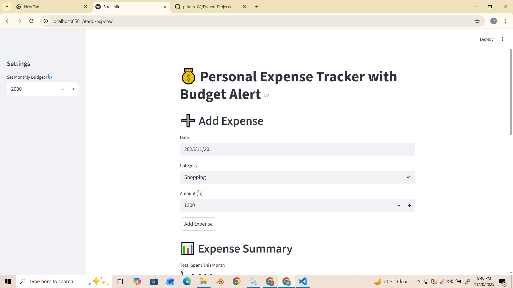
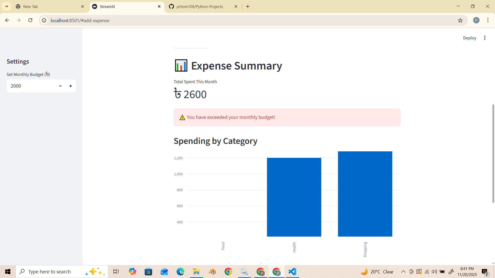
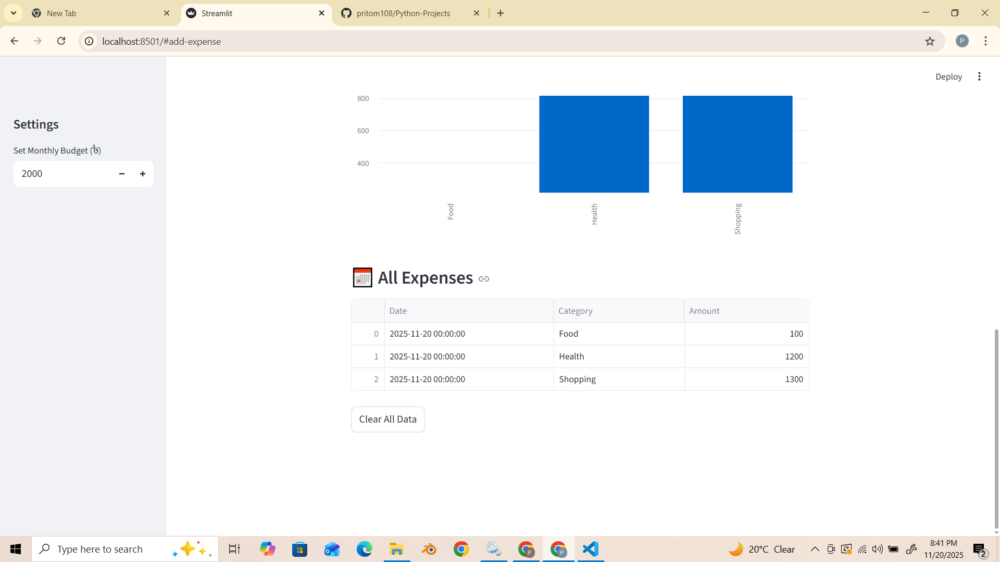

# 💰 Personal Expense Tracker (Python + Streamlit)

A simple and powerful **Expense Tracking Application** built using **Python** and **Streamlit**.  
This app allows users to quickly add daily expenses, visualize spending, set monthly budgets, and receive alerts when the budget is exceeded.

Perfect for students, families, freelancers, or anyone who wants better control over their monthly spending.

---

## 🚀 Features

- ➕ **Add Expenses** with date, category, and amount  
- 📊 **Bar Chart Visualization** of expenses by category  
- 💸 **Budget Setting & Alerts**  
  - Automatically warns you if total spending exceeds the monthly budget  
- 📅 **View All Expenses** in a clean table  
- 💾 **Data stored locally** in a CSV file (`expenses.csv`)  
- 🧹 **Clear All Data** with one click  
- ⚡ Fast & user-friendly Streamlit interface  

---

## 🛠️ Technologies Used

- **Python**
- **Streamlit**
- **Pandas**
- **CSV File Storage**

---

### 📸 App in Action
Visualizing the app's working and main functions:

  <b>1. Adding an Expense</b> – Enter date, category, and amount. 
  

  <b>2. Expense Summary & Charts</b> – View total spending and category-wise bar chart. 
  

  <b>3. Budget Alert & Data Table</b> – Get budget alerts and see all expense records. 
  

---

## 📂 Project Structure

<pre>
📁 expense-tracker/
│
├── app.py
├── expenses.csv (auto-created on first run)
└── README.md
<pre>
